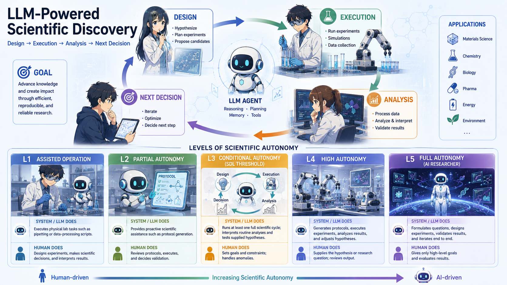

# Awesome LLM for Self-Driving Labs

> A curated list of LLM-powered L3+ autonomous science systems, self-driving labs, benchmarks, and related resources.

Focus: L3+ systems where LLMs participate in wet-lab, robotic, instrument, or other physical experimental loops: design -> execution -> analysis -> next decision.

Resources are organized by domain. Computational-only agents are kept as adjacent references; benchmarks, protocols, and infrastructure are included when they support L3+ automation.

**SDL autonomy classification**: A five-level physical-lab autonomy scale. L3 is the SDL threshold: the system decides what experiment to run next for at least one closed scientific cycle.

- [Perspectives for self-driving labs in synthetic biology](https://doi.org/10.1016/j.copbio.2022.102881), which discusses laboratory autonomy levels and closed Design-Build-Test-Learn loops.
- [Autonomous laboratories for accelerated materials discovery](https://doi.org/10.1039/D4DD00059E), which proposes L0-L5 laboratory autonomy levels inspired by SAE vehicle autonomy.
- [Self-Driving Laboratories for Chemistry and Materials Science](https://doi.org/10.1021/acs.chemrev.4c00055), a broad review of SDL technology and autonomy in chemistry/materials.
- [From Automation to Autonomy: A Survey on Large Language Models in Scientific Discovery](https://arxiv.org/abs/2505.13259), which uses a three-level LLM autonomy framing: LLM as tool, analyst, and scientist.

| Level | Name | System / LLM does | Human does |
| --- | --- | --- | --- |
| L1 | Assisted operation | Executes physical lab tasks such as pipetting or data-processing scripts. | Designs experiments, makes scientific decisions, and interprets results. |
| L2 | Partial autonomy | Provides proactive scientific assistance such as protocol generation. | Reviews protocols, executes, and decides validation. |
| L3 | Conditional autonomy (SDL threshold) | Runs at least one full scientific cycle; interprets routine analyses and tests supplied hypotheses. | Sets goals and constraints; handles anomalies. |
| L4 | High autonomy | Generates protocols, executes experiments, analyzes results, and adjusts hypotheses. | Supplies the hypothesis or research question; reviews output. |
| L5 | Full autonomy (AI researcher) | Formulates questions, designs experiments, validates results, and iterates end to end. | Gives only high-level goals and evaluates results. |

## 📰 News

- **Atinary's AI & Self-Driving Labs on AWS Accelerate R&D for Takeda and MIT** *(Atinary / AWS)* - [AWS blog](https://aws.amazon.com/blogs/physical-ai/atinarys-ai-self-driving-labs-on-aws-accelerate-rd-for-takeda-and-mit/)

- **Ginkgo Bioworks' Autonomous Laboratory Driven by OpenAI's GPT-5** *(Ginkgo Bioworks / OpenAI)* - [press release](https://www.prnewswire.com/news-releases/ginkgo-bioworks-autonomous-laboratory-driven-by-openais-gpt-5-achieves-40-improvement-over-state-of-the-art-scientific-benchmark-302680619.html)

- **AI, Automation Drive Autonomous Science** - [Newswise](https://www.newswise.com/doescience/ai-automation-drive-autonomous-science)

- **When AI Takes Over Scientific Discovery** - [Forbes](https://www.forbes.com/sites/craigsmith/2025/03/23/when-ai-takes-over-scientific-discovery/)

- **AI Boosts Research Careers, but Flattens Scientific Discovery** - [IEEE Spectrum](https://spectrum.ieee.org/ai-science-research-flattens-discovery)

## ⭐ Notable GitHub Projects

- **MADSci: Modular Autonomous Discovery for Science** *(AD-SDL)* - [GitHub](https://github.com/AD-SDL/MADSci)

- **Self-Driving Lab Demo** *(Sparks-Baird)* - [GitHub](https://github.com/sparks-baird/self-driving-lab-demo)

- **LabClaw** - [GitHub](https://github.com/labclaw/labclaw)

- **device-use: AI Agents for Lab Device GUIs** *(LabClaw)* - [GitHub](https://github.com/labclaw/device-use)

- **AC Dev Lab** *(Acceleration Consortium)* - [GitHub](https://github.com/AccelerationConsortium/ac-dev-lab)

- **Awesome Self-Driving Labs** *(Acceleration Consortium)* - [GitHub](https://github.com/AccelerationConsortium/awesome-self-driving-labs)

## 🧪 Chemistry and Materials

- **Coscientist: Autonomous Chemical Research with Large Language Models** *(Carnegie Mellon University)* - [Nature paper](https://www.nature.com/articles/s41586-023-06792-0) / [technical note](https://hunterheidenreich.com/notes/chemistry/llm-applications/autonomous-chemical-research-coscientist/)

- **Augmenting Large Language Models with Chemistry Tools** *(ChemCrow)* - [Nature Machine Intelligence](https://www.nature.com/articles/s42256-024-00832-8)

- **AI-Chemist: An All-Round AI-Chemist with a Scientific Mind** - [paper](https://pmc.ncbi.nlm.nih.gov/articles/PMC9674120/)

- **ChemAgents: A Multi-Agent-Driven Robotic AI Chemist** *(University of Birmingham)* - [ChemRxiv](https://chemrxiv.org/doi/10.26434/chemrxiv-2024-w953h) / [project page](https://research.birmingham.ac.uk/en/publications/a-multi-agent-driven-robotic-ai-chemist-enabling-autonomous-chemi/)

- **A-Lab: An Autonomous Laboratory for the Accelerated Synthesis of Novel Materials** *(UC Berkeley / Ceder Group)* - [paper](https://pmc.ncbi.nlm.nih.gov/articles/PMC10700133/) / [Berkeley page](https://ceder.berkeley.edu/research-areas/autonomous-experimentation-for-accelerated-materials-discovery/) / [correction coverage](https://cen.acs.org/research-integrity/Nature-robot-chemist-paper-corrected/104/web/2026/01)

- **MARS: Knowledge-Driven Autonomous Materials Research via Collaborative Multi-Agent and Robot System** *(Shenzhen Institute of Advanced Technology)* - [paper](https://www.sciencedirect.com/science/article/abs/pii/S2590238525006204) / [technical coverage](https://www.labmanager.com/closed-loop-autonomous-materials-discovery-system-advances-lab-innovation-34949)

- **Large Language Models for Porous Materials: From Text Mining to Autonomous Laboratory** - [Digital Discovery](https://pubs.rsc.org/en/content/articlehtml/2026/dd/d5dd00578g)

- **Artificial Intelligence-Driven Autonomous Laboratory for Accelerating Chemical Discovery** - [paper](https://www.oaepublish.com/articles/cs.2025.66)

- **Autonomous Laboratories in China: An Embodied Intelligence-Driven Platform to Accelerate Chemical Discovery** - [paper](https://www.sciencedirect.com/org/science/article/pii/S2635098X25000956)

## 🧬 Biology and Biomedicine

- **The Virtual Lab: AI Agents Design New SARS-CoV-2 Nanobodies** *(Stanford Medicine)* - [bioRxiv](https://www.biorxiv.org/content/10.1101/2024.11.11.623004v1) / [PubMed](https://pubmed.ncbi.nlm.nih.gov/40730228/) / [Stanford news](https://med.stanford.edu/news/all-news/2025/07/virtual-scientist.html)

- **Robin** *(FutureHouse)* - [arXiv](https://arxiv.org/abs/2505.13400) / [Nature paper](https://www.nature.com/articles/s41586-026-10652-y) / [FutureHouse blog](https://www.futurehouse.org/research/demonstrating-end-to-end-scientific-discovery-with-robin-a-multi-agent-system)

- **Accelerating Scientific Discovery with Co-Scientist** *(Google Research)* - [Nature paper](https://www.nature.com/articles/s41586-026-10644-y) / [PubMed](https://pubmed.ncbi.nlm.nih.gov/42156544/) / [preprint](https://arxiv.org/abs/2502.18864) / [Google Research blog](https://research.google/blog/accelerating-scientific-breakthroughs-with-an-ai-co-scientist/)

## 🤖 Protocols and Lab Automation

- **Expert-Level Protocol Translation for Self-Driving Labs** - [paper](https://arxiv.org/abs/2411.00444)

- **Evaluating Large Language Model Agents for Automation of Atomic Force Microscopy** - [Nature Communications](https://www.nature.com/articles/s41467-025-64105-7)

- **Toward Full Autonomous Laboratory Instrumentation Control with Large Language Models** - [paper](https://onlinelibrary.wiley.com/doi/full/10.1002/sstr.202500173)

- **Integrating Domain-Specialized Language Models with AI Measurement Tools for Deterministic Atomic-Resolution Experimentation** - [arXiv](https://arxiv.org/abs/2602.20669)

- **Perspective on Utilizing Foundation Models for Laboratory Automation** - [paper](https://www.tandfonline.com/doi/full/10.1080/27660400.2025.2582379)

- **LAP: An Agent-to-Instrument Protocol for Autonomous Science** *(Shiyanjia Lab)* - [paper](https://arxiv.org/abs/2606.03755)

- **From Prompts to Protocols: An AI Agent for Laboratory Automation** - [paper](https://arxiv.org/html/2605.16552v1) / [EOS project](https://unc-robotics.github.io/eos/)

- **Multi-Agent Systems for Autonomous Laboratory Instrument Operation** *(Zeiss Research Microscopy Solutions)* - [paper](https://naterthought.com/papers/VGPT.pdf)

## 📊 Benchmarks and Evaluation

- **GeneBench-Pro** *(OpenAI)* - [announcement](https://openai.com/index/introducing-genebench-pro/) / [case studies](https://openai.com/index/genebench-pro/case-studies/) / [paper](https://www.biorxiv.org/content/10.64898/2026.06.29.735386v1) / [public package](https://huggingface.co/datasets/ajh-oai/genebench-pro-public-package)

- **ScienceAgentBench** *(Ohio State University NLP Group)* - [paper](https://arxiv.org/abs/2410.05080) / [project](https://osu-nlp-group.github.io/ScienceAgentBench/) / [code](https://github.com/OSU-NLP-Group/ScienceAgentBench)

- **DISCOVERYWORLD** *(Allen Institute for AI)* - [paper](https://arxiv.org/abs/2406.06769) / [code](https://github.com/allenai/discoveryworld) / [technical blog](https://allenai.org/blog/evaluating-scientific-discovery-agents)

- **BioPlanner / BioProt** *(Align to Innovate / FutureHouse / University of Oxford)* - [paper](https://arxiv.org/abs/2310.10632)

- **A-Lab Reproducibility and Novelty Dispute** - [C&EN coverage](https://cen.acs.org/research-integrity/Nature-robot-chemist-paper-corrected/104/web/2026/01) / [Chemistry World coverage](https://www.chemistryworld.com/news/new-analysis-raises-doubts-over-autonomous-labs-materials-discoveries/4018791.article)

## 🛡️ Safety and Reliability

- **Hallucination, Reliability, and the Role of Generative AI in Science** - [paper](https://arxiv.org/abs/2504.08526)

- **Are Large Language Models Reliable AI Scientists? Assessing Reverse-Engineering of Black-Box Systems** *(Princeton University)* - [paper](https://arxiv.org/abs/2505.17968)

- **AI Scientists Fail Without Strong Implementation Capability** - [paper](https://arxiv.org/abs/2506.01372)

- **The Singapore Consensus on Global AI Safety Research Priorities** - [paper](https://arxiv.org/abs/2506.20702) / [report](https://www.scai.gov.sg/2025/scai2025-report/)

## 📚 Surveys and Position Papers

- **From Automation to Autonomy: A Survey on Large Language Models in Scientific Discovery** - [EMNLP paper](https://aclanthology.org/2025.emnlp-main.895/) / [arXiv](https://arxiv.org/abs/2505.13259) / [awesome list](https://github.com/HKUST-KnowComp/Awesome-LLM-Scientific-Discovery)

- **Position: Intelligent Science Laboratory Requires the Integration of Cognitive and Embodied AI** - [paper](https://arxiv.org/abs/2506.19613)

- **Agent4S: The Transformation of Research Paradigms from the Perspective of Large Language Models** - [paper](https://arxiv.org/abs/2506.23692)

- **AI4Research: A Survey of Artificial Intelligence for Scientific Research** - [paper](https://arxiv.org/abs/2507.01903) / [project](https://ai-4-research.github.io/)

- **Exploring the Role of Large Language Models in the Scientific Method: From Hypothesis to Discovery** - [npj Artificial Intelligence](https://www.nature.com/articles/s44387-025-00019-5)

- **Self-Driving Laboratories for Chemistry and Materials Science** - [review](https://doi.org/10.1021/acs.chemrev.4c00055)

- **Perspectives for Self-Driving Labs in Synthetic Biology** - [review](https://doi.org/10.1016/j.copbio.2022.102881)

- **Autonomous Laboratories for Accelerated Materials Discovery** - [perspective](https://doi.org/10.1039/D4DD00059E)

- **From Equation Discovery to Autonomous Discovery Systems** - [survey](https://arxiv.org/html/2305.02251v2)

## 🧭 Adjacent Computational Systems

Computational-only systems are listed as adjacent references. This repository primarily focuses on LLM-driven automation connected to physical environments, including wet labs, instruments, robotics, and closed-loop experimental platforms.

- **The AI Scientist** *(Sakana AI)* - [paper](https://arxiv.org/abs/2408.06292) / [Sakana AI blog](https://sakana.ai/ai-scientist/) / [code](https://github.com/SakanaAI/AI-Scientist)

- **The AI Scientist-v2** *(Sakana AI)* - [paper](https://arxiv.org/abs/2504.08066) / [code](https://github.com/SakanaAI/AI-Scientist-v2)

- **Agent Laboratory** *(Schmidgall et al.)* - [paper](https://arxiv.org/abs/2501.04227) / [project](https://agentlaboratory.github.io/) / [code](https://github.com/SamuelSchmidgall/AgentLaboratory)

- **Autonomous Agents for Scientific Discovery: Orchestrating Scientists, Language, Code, and Physics** - [arXiv](https://arxiv.org/html/2510.09901v2)

- **Towards End-to-End Automation of AI Research** - [Nature paper](https://www.nature.com/articles/s41586-026-10265-5)

## 🤝 Contributing

Contributions are welcome. Prefer L3+ primary sources: papers, official repositories, project pages, benchmark pages, technical blogs, and correction notices.

## 📄 License

This project is licensed under the MIT License - see the LICENSE file for details.
